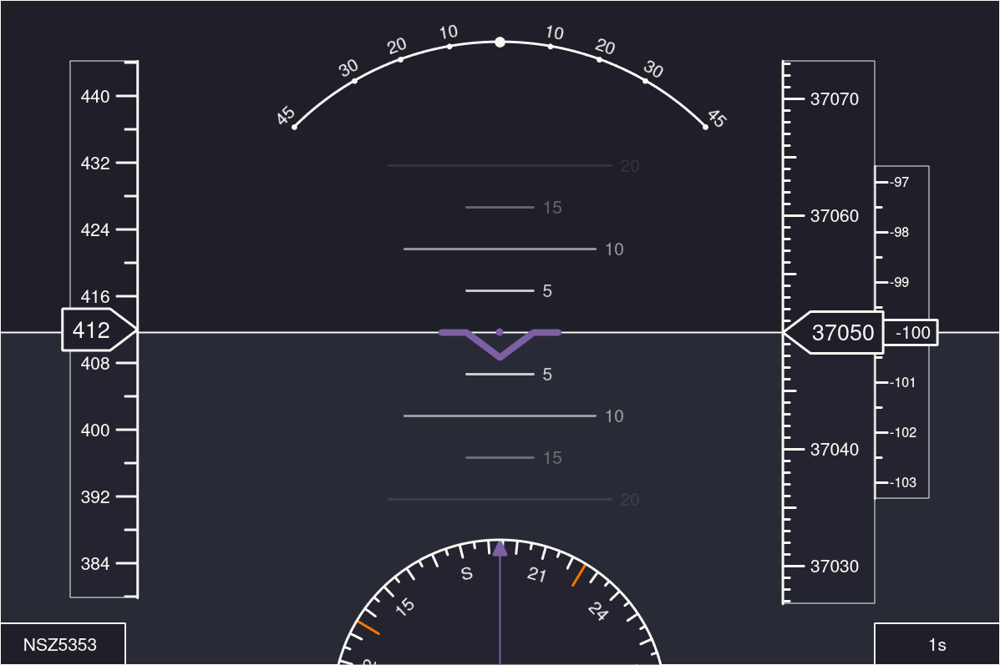

# dump1090 ADS-B PFD

A dirty adaptation of [shadymeowy's QPrimaryFlightDisplay](https://github.com/shadymeowy/QPrimaryFlightDisplay) for use with ads-b data from dump1090.

## Features

- Ground speed, altitude, heading and vertical speed indicators
- Flight selector (bottom left)
- Time since last seen (bottom right)
- No signal indicator

## Usage

1. Start the dump1090 webserver

```bash
dump1090 --net
```

2. Edit the url variable in `main.py` if needed, default is

```
http://localhost:8080/dump1090/data.json
```

3. Launch the script

```bash
python3 main.py
```

## Screenshots



## Dependencies

- PySide6: https://wiki.qt.io/Qt_for_Python
